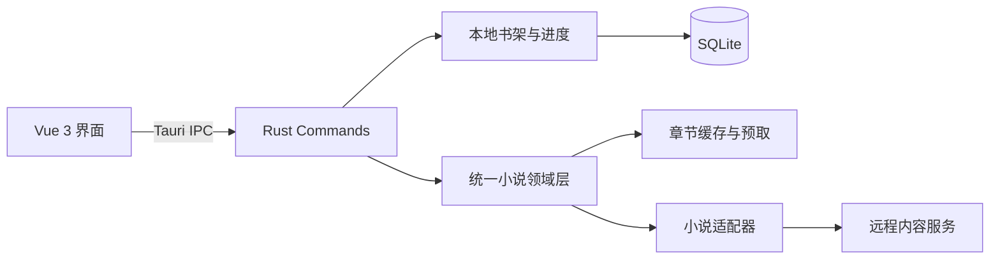

<div align="center">
  

# Movel

**简洁、舒适、专注于阅读体验的跨平台轻小说阅读器**

基于 Tauri 2、Vue 3 与 Rust 构建，在原生应用的轻量体验中，完成小说搜索、收藏与沉浸式阅读。

[](https://tauri.app/)
[](https://vuejs.org/)
[](https://www.rust-lang.org/)
[](https://www.typescriptlang.org/)

</div>

## 关于 Movel

Movel 是一款桌面轻小说阅读器。前端负责轻盈、响应式的阅读界面，Rust 后端负责书源访问、内容解析、本地数据持久化与缓存；两端通过 Tauri IPC 直接通信，正式版本无需额外启动本地 HTTP 服务。

目前内置两个书源，并通过统一的书源接口将内容转换为与来源无关的阅读文档，便于继续扩展新的网络书源或本地格式。

## 功能

- **多书源搜索**：按书名或作者检索作品，可在不同书源间快速切换。
- **作品详情与目录**：展示封面、作者、状态、简介、更新时间以及分卷章节目录。
- **本地书架**：收藏喜欢的作品，并按最近阅读时间自动排序。
- **阅读进度同步**：自动保存章节与阅读位置，再次打开即可继续阅读。
- **两种阅读模式**：支持连续滚动与分页阅读；横屏宽屏下可自动使用双页布局。
- **丰富的阅读设置**：自由调整字体、字号、行距、字距、段距与正文宽度。
- **三套阅读主题**：纸张、明亮与夜间主题，设置会自动保存在本地。
- **便捷翻页操作**：分页模式支持按钮、键盘方向键、空格键与触摸滑动。
- **章节智能预取**：阅读时预取后续章节，并使用内存 LRU 缓存减少等待。
- **响应式界面**：适配桌面与窄屏窗口，并支持 Android 返回行为。

## 特点

| 特点 | 说明 |
| --- | --- |
| 轻量原生 | Tauri 使用系统 WebView，相比捆绑完整浏览器内核拥有更小的应用体积。 |
| Rust 驱动 | 网络请求、HTML 解析、缓存与持久化均在 Rust 侧完成。 |
| 数据留在本地 | 书架和阅读进度保存在应用数据目录中的 SQLite 数据库。 |
| 书源解耦 | 各书源实现统一接口，UI 只消费通用领域模型，不依赖具体提供方。 |
| 阅读优先 | 界面使用克制的暖色视觉、响应式排版与可定制阅读参数。 |
| 开发友好 | Debug 模式提供仅监听 localhost 的浏览器调用桥，方便使用 Chrome DevTools 调试。 |

## 技术栈

### 前端

- [Vue 3](https://vuejs.org/) + Composition API
- [TypeScript](https://www.typescriptlang.org/)
- [Element Plus](https://element-plus.org/)
- [Vite](https://vite.dev/)

### 原生后端

- [Tauri 2](https://tauri.app/)：窗口、IPC 与跨平台应用打包
- [Rust](https://www.rust-lang.org/) + Tokio：业务逻辑与异步任务
- [Reqwest](https://docs.rs/reqwest/)：HTTP 请求与压缩传输
- [Scraper](https://docs.rs/scraper/)：HTML 内容解析
- [SQLite](https://www.sqlite.org/) + Rusqlite：书架和阅读进度持久化
- Serde / Thiserror：数据序列化与结构化错误处理

## 架构



项目中的内容会先转换为统一的 `ReaderDocument`，阅读器组件无需了解数据来自 EPUB、TXT 还是网络书源。这让 UI、内容解析和传输逻辑可以独立演进。

## 快速开始

### 环境要求

- Node.js 与 [pnpm](https://pnpm.io/)
- [Rust](https://www.rust-lang.org/tools/install/)
- 当前平台所需的 [Tauri 系统依赖](https://v2.tauri.app/start/prerequisites/)

### 启动完整应用

```bash
pnpm install
pnpm tauri dev
```

仅开发前端界面时，可以运行：

```bash
pnpm dev
```

### 构建

```bash
pnpm tauri build
```

构建产物位于 `src-tauri/target/release/bundle/`。

## 开发与检查

```bash
# 前端类型检查与生产构建
pnpm build

# Rust 测试
cd src-tauri && cargo test

# Rust 格式与静态检查
cd src-tauri && cargo fmt --check
cd src-tauri && cargo clippy --all-targets -- -D warnings
```

## 在 Chrome 中调试

Movel 在 Debug 构建中提供 HTTP invoke bridge。保持完整开发进程运行：

```bash
pnpm tauri dev
```

随后在 Chrome 中打开 [http://localhost:1420](http://localhost:1420)。前端发起的 `invoke()` 调用会经由 `http://127.0.0.1:3030` 转发到 Tauri command handler，因此可以在 DevTools 的 Network 面板中观察请求；原生窗口仍然使用正常的 IPC 通道。

> [!IMPORTANT]
> 调试桥仅在 Rust Debug 构建中启动，并且只监听 `127.0.0.1`。它允许浏览器来源通过 CORS，请勿将其暴露为生产 API。如果 `3030` 端口已被占用，请先关闭冲突进程。

## 项目结构

```text
Movel/
├── src/
│   ├── components/       # Vue 组件与阅读器
│   ├── composables/      # 书架、阅读设置等状态逻辑
│   ├── domain/           # 与书源无关的前端领域模型
│   ├── services/         # Tauri IPC 服务封装
│   └── sources/          # 阅读文档数据源适配
├── src-tauri/
│   ├── capabilities/     # 最小化的 Tauri 权限配置
│   └── src/
│       ├── novel/        # 书源、解析器、缓存与领域模型
│       └── library.rs    # SQLite 书架与阅读进度
└── scripts/              # 开发与平台同步脚本
```

## 声明

Movel 仅作为技术学习与个人阅读工具。作品内容、封面及相关信息均来自对应的第三方书源，其版权归原作者及权利人所有。请遵守当地法律法规与内容提供方的使用条款，支持正版阅读。
