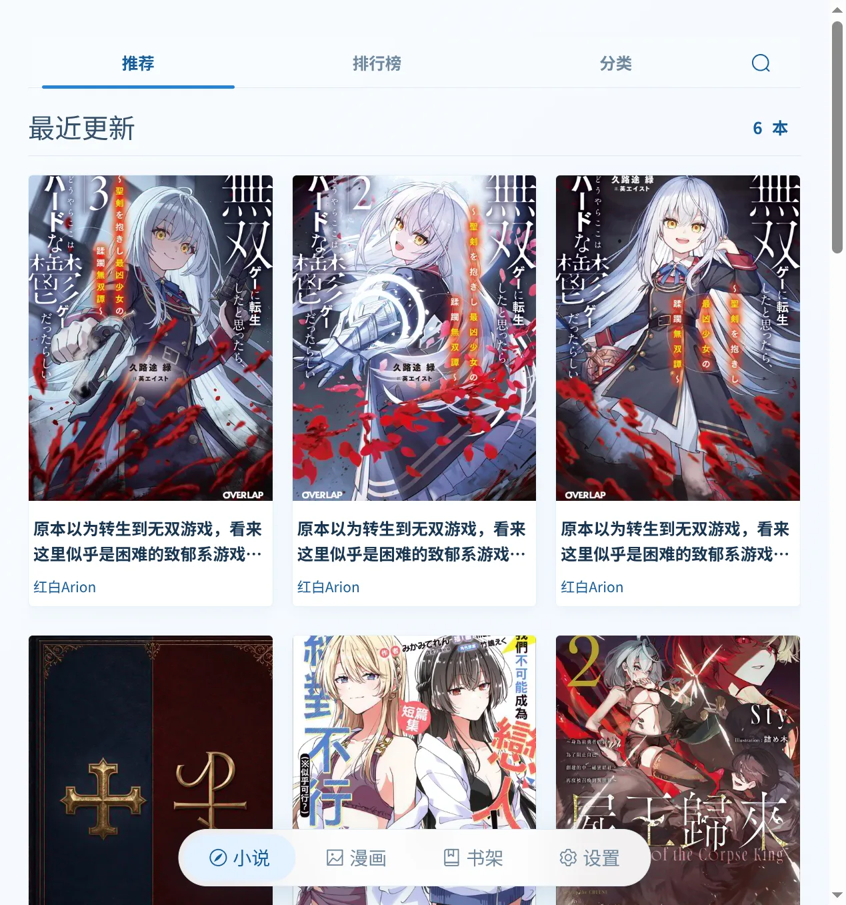

<div align="center">
  

# Movel

**LightNovel 轻书架的非官方第三方客户端**

基于 Tauri 2、Vue 3 与 Rust 构建，提供小说与漫画浏览、书架、阅读和官方账号同步能力。

[](https://tauri.app/)
[](https://vuejs.org/)
[](https://www.rust-lang.org/)
[](https://www.typescriptlang.org/)
[](LICENSE)

</div>

## 关于 Movel

Movel 是 [LightNovel 轻书架](https://www.lightnovel.life/) 的非官方第三方客户端。前端提供轻盈、响应式的阅读界面；Rust 后端作为官方 API 的客户端边界，负责认证、请求、响应校验与领域 DTO 映射；两端通过 Tauri IPC 通信。

> [!WARNING]
> 项目目前处于快速迭代阶段。功能、界面与数据契约可能随版本调整；欢迎通过 Issue 反馈问题和建议。

## 界面预览



## 功能

- **小说与漫画浏览**：推荐、排行榜、分类和关键词搜索。
- **作品详情与目录**：查看封面、作者、状态、简介、标签及章节目录。
- **官方书架与账号**：登录后同步小说、漫画收藏与阅读进度。
- **沉浸式阅读**：支持小说章节阅读与漫画章节阅读。
- **两种阅读模式**：支持连续滚动与分页阅读；横屏宽屏下可自动使用双页布局。
- **丰富的阅读设置**：自由调整字体、字号、行距、字距、段距与正文宽度。
- **三套阅读主题**：纸张、明亮与夜间主题，设置会自动保存在本地。
- **便捷翻页操作**：分页模式支持按钮、键盘方向键、空格键与触摸滑动。
- **响应式界面**：适配桌面与窄屏窗口，并支持 Android 返回行为。

## 特点

| 特点 | 说明 |
| --- | --- |
| 轻量原生 | Tauri 使用系统 WebView，相比捆绑完整浏览器内核拥有更小的应用体积。 |
| Rust 驱动 | 官方 API 访问、认证、响应校验和 DTO 映射均在 Rust 侧完成。 |
| 官方服务同步 | 认证、书架、阅读位置与内容由 LightNovel 轻书架服务维护。 |
| 清晰边界 | UI 只调用类型化 Tauri commands，不处理上游 URL、令牌或响应解析。 |
| 阅读优先 | 界面使用克制的暖色视觉、响应式排版与可定制阅读参数。 |
| 开发友好 | Debug 模式提供仅监听 localhost 的浏览器调用桥，方便使用 Chrome DevTools 调试。 |

## 技术栈

### 前端

- [Vue 3](https://vuejs.org/) + Composition API
- [TypeScript](https://www.typescriptlang.org/)
- [Element Plus](https://element-plus.org/)
- [Vite](https://vite.dev/)

### 原生后端

- [Tauri 2](https://tauri.app/)：窗口、IPC 与跨平台应用打包
- [Rust](https://www.rust-lang.org/) + Tokio：业务逻辑与异步任务
- [Reqwest](https://docs.rs/reqwest/)：HTTP 请求与压缩传输
- Tokio Tungstenite：SignalR WebSocket 通信
- Keyring：系统凭据库中的刷新凭据存储
- Serde / Thiserror：数据序列化与结构化错误处理

## 快速开始

### 环境要求

- Node.js 与 [pnpm](https://pnpm.io/)
- [Rust](https://www.rust-lang.org/tools/install/)
- 当前平台所需的 [Tauri 系统依赖](https://v2.tauri.app/start/prerequisites/)

### 启动完整应用

```bash
pnpm install
pnpm tauri dev
```

仅开发前端界面时，可以运行：

```bash
pnpm dev
```

### 构建

```bash
pnpm tauri build
```

构建产物位于 `src-tauri/target/release/bundle/`。

## 开发与检查

```bash
# 前端类型检查与生产构建
pnpm build

# Rust 测试
cd src-tauri && cargo test

# Rust 格式与静态检查
cd src-tauri && cargo fmt --check
cd src-tauri && cargo clippy --all-targets -- -D warnings
```

## 在 Chrome 中调试

Movel 在 Debug 构建中提供 HTTP invoke bridge。保持完整开发进程运行：

```bash
pnpm tauri dev
```

随后在 Chrome 中打开 [http://localhost:1420](http://localhost:1420)。前端发起的 `invoke()` 调用会经由 `http://127.0.0.1:3030` 转发到 Tauri command handler，因此可以在 DevTools 的 Network 面板中观察请求；原生窗口仍然使用正常的 IPC 通道。

> [!IMPORTANT]
> 调试桥仅在 Rust Debug 构建中启动，并且只监听 `127.0.0.1`。它允许浏览器来源通过 CORS，请勿将其暴露为生产 API。如果 `3030` 端口已被占用，请先关闭冲突进程。

## 项目结构

```text
Movel/
├── src/
│   ├── components/       # Vue 组件
│   ├── pages/            # 小说、漫画、阅读器与设置页面
│   ├── services/         # 类型化 Tauri command 调用封装
│   └── stores/           # 前端应用状态
├── src-tauri/
│   ├── capabilities/     # 最小化的 Tauri 权限配置
│   └── src/
│       ├── api.rs        # 官方 API 客户端、认证与请求处理
│       ├── commands/     # 小说、漫画、书架与用户命令
│       └── dto/          # 上游与命令 DTO
├── docs/images/          # README 展示图片
└── scripts/              # 开发与平台同步脚本
```

## 声明

Movel 是独立开发的非官方客户端，与 LightNovel 轻书架及其运营方没有隶属或授权关系。作品内容、封面与相关信息均由服务提供方提供，其版权归原作者及权利人所有。请遵守当地法律法规与服务使用条款，支持正版阅读。

## 开源协议

本项目基于 [MIT License](LICENSE) 开源。
